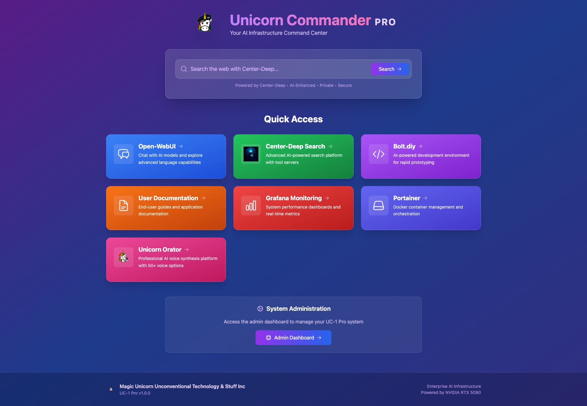
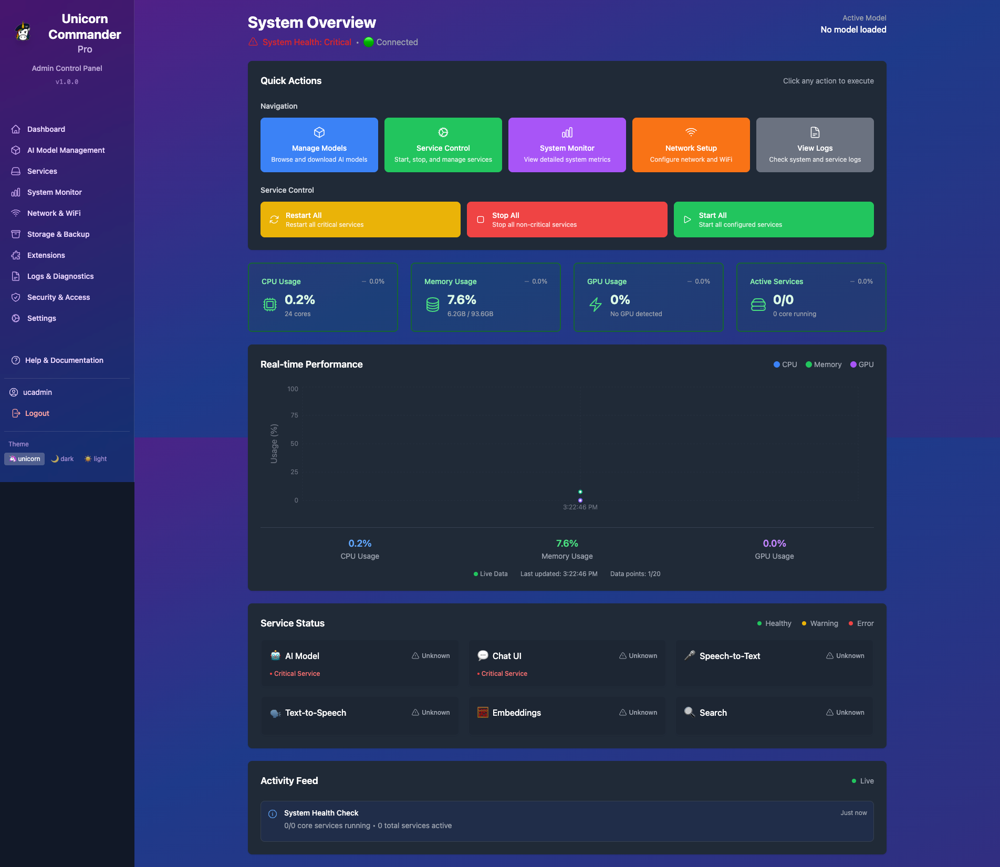
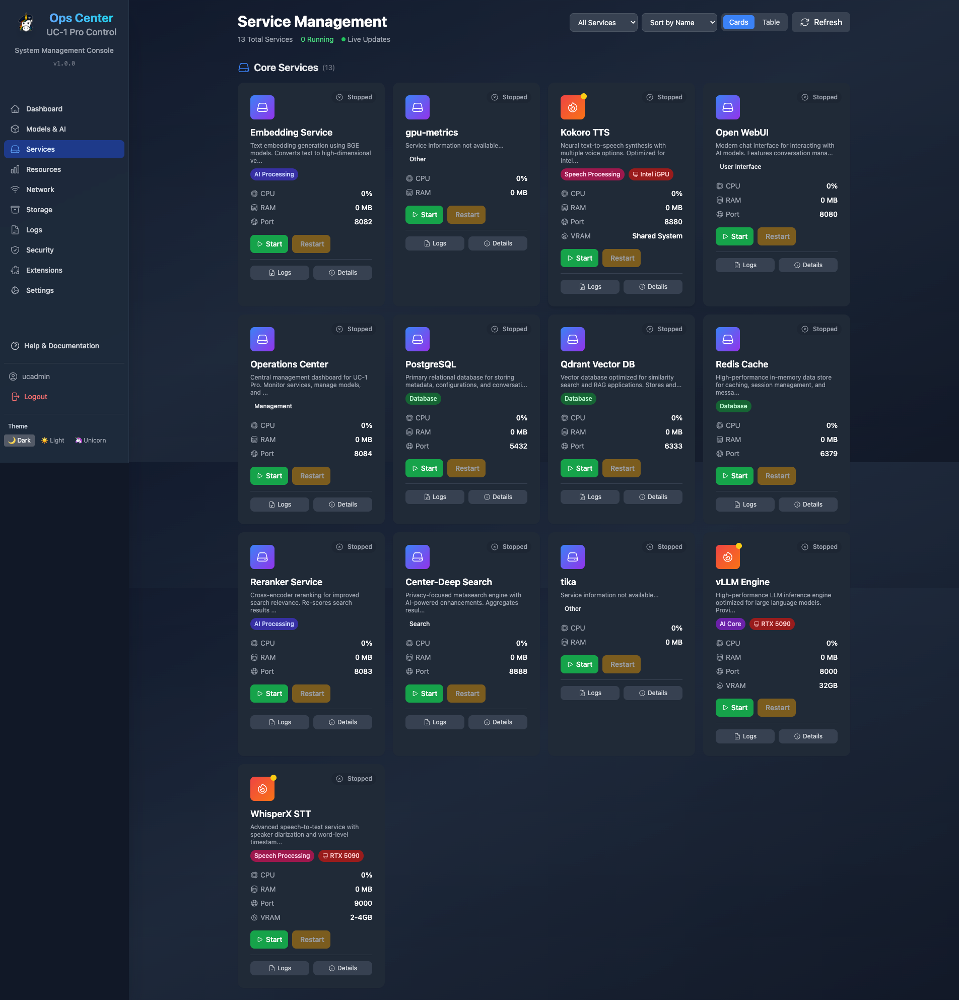
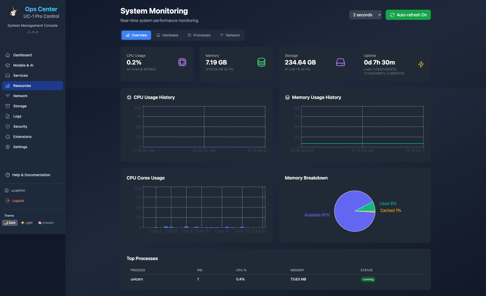
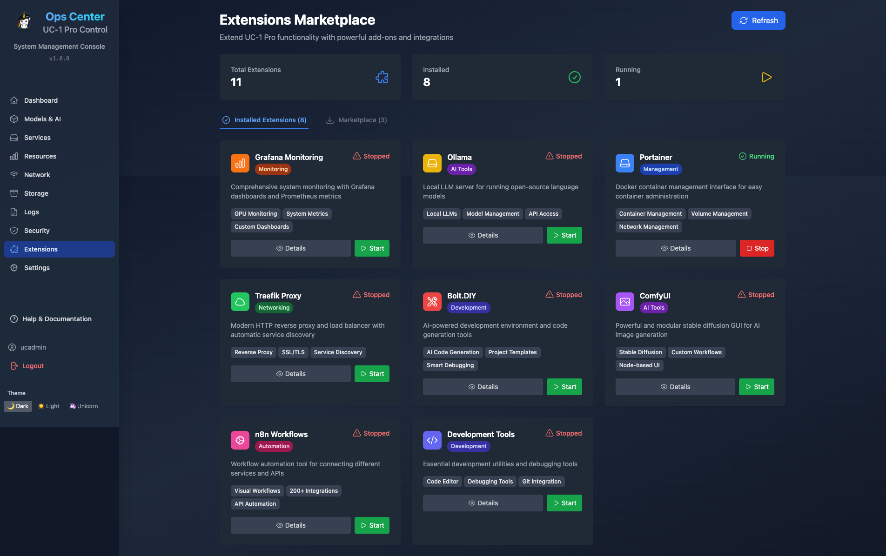

# UC-1 Pro - Enterprise AI Stack for RTX 5090 🚀

<div align="center">

[](https://github.com/Unicorn-Commander/UC-1-Pro/stargazers)
[](LICENSE)
[](https://www.docker.com/)
[](https://www.nvidia.com/)

**Transform your RTX 5090 into an AI powerhouse with UC-1 Pro**

[🌐 Website](https://unicorncommander.com) • [📖 Documentation](http://localhost:8081) • [🏢 Company](https://magicunicorn.tech) • [🐛 Issues](https://github.com/Unicorn-Commander/UC-1-Pro/issues)

</div>

---

## 🎯 What is UC-1 Pro?

UC-1 Pro is a production-ready, modular AI infrastructure stack that unleashes the full potential of NVIDIA RTX 5090 GPUs. Built by [Magic Unicorn Unconventional Technology & Stuff Inc](https://magicunicorn.tech), it provides enterprise-grade AI capabilities with the simplicity of a single command deployment.

### ✨ Key Features

- **🚀 Blazing Fast Inference** - vLLM engine optimized for RTX 5090's 32GB VRAM
- **🎙️ Advanced Speech Processing** - WhisperX STT with speaker diarization
- **🗣️ Natural Voice Synthesis** - Kokoro TTS with multiple voice options
- **🔍 Intelligent Search** - Self-hosted SearXNG with privacy protection
- **📄 Document Intelligence** - OCR and document processing with Apache Tika
- **🎨 Image Generation Ready** - ComfyUI extension for Flux models
- **📊 Built-in Monitoring** - Prometheus & Grafana for system insights
- **🔒 Enterprise Security** - Automated backups, SSL support, API authentication
- **🧩 Modular Architecture** - Enable only what you need
- **⚡ Smart Health Checks** - Accurate service status monitoring
- **📥 Model Pre-download** - Optional script to download models before startup

## 📸 Operations Center Dashboard

UC-1 Pro includes a comprehensive web-based Operations Center for system administration and user access.

### 🏠 Main Dashboard Views

<div align="center">

#### User Dashboard & Homepage

<p><em>User-friendly interface with search capabilities and quick access to AI services</em></p>

#### Admin Dashboard  

<p><em>Complete system oversight with real-time monitoring and service management</em></p>

</div>

### 🛠️ Management Features

<div align="center">

<table>
<tr>
<td width="33%" align="center">

<br><strong>🤖 AI Model Management</strong>
<br>Search, download & manage LLM models
</td>
<td width="33%" align="center">

<br><strong>⚙️ Service Management</strong>  
<br>Real-time service monitoring & control
</td>
<td width="33%" align="center">

<br><strong>📊 System Monitoring</strong>
<br>GPU, CPU, memory & disk analytics
</td>
</tr>
<tr>
<td width="33%" align="center">

<br><strong>🔧 Settings & Config</strong>
<br>System configuration & preferences
</td>
<td width="33%" align="center">

<br><strong>🧩 Extensions</strong>
<br>One-click extension deployment
</td>
<td width="33%" align="center">

<br><strong>🔒 Security Center</strong>
<br>User accounts & API management
</td>
</tr>
</table>

</div>

## 🚀 Quick Start

### Prerequisites

- Ubuntu 24.04 LTS (Secure Boot compatible)
- NVIDIA RTX 5090 (32GB VRAM)
- 96GB RAM (minimum 64GB)
- 200GB+ storage (500GB+ recommended for models)

### Installation

```bash
# Clone the repository
git clone https://github.com/Unicorn-Commander/UC-1-Pro.git
cd UC-1-Pro

# Run the installer - it handles everything!
./install.sh

# (Optional) Pre-download models for faster startup
./scripts/download-models.sh

# Start your AI stack
./start.sh
```

That's it! The installer automatically configures Docker, NVIDIA drivers (with Secure Boot support), and all dependencies.

## 🖥️ Web Interfaces

Once running, access your AI services:

| Service | URL | Description |
|---------|-----|-------------|
| **Open-WebUI** | http://localhost:8080 | Main AI chat interface |
| **vLLM API** | http://localhost:8000 | OpenAI-compatible API |
| **Documentation** | http://localhost:8081 | Full system documentation |
| **Model Manager** | http://localhost:8084 | Manage AI models |
| **SearXNG** | http://localhost:8888 | Private search engine |

## 🏗️ Architecture

<details>
<summary>Click to expand architecture details</summary>

UC-1 Pro uses a microservices architecture optimized for different hardware components:

### GPU Services (RTX 5090)
- **vLLM** - High-performance LLM inference engine
- **ComfyUI** (Extension) - Flux image generation

### CPU/Intel iGPU Services
- **WhisperX** - Speech-to-text processing
- **Kokoro TTS** - Text-to-speech synthesis
- **Embeddings** - Text vectorization
- **Reranker** - Search result optimization

### Data Layer
- **PostgreSQL** - Relational data & metadata
- **Redis** - High-speed caching & queuing
- **Qdrant** - Vector database for RAG

</details>

## 🛠️ Management Commands

```bash
# Quick actions
make start          # Start all services
make stop           # Stop all services
make status         # Check service status
make health         # Run health checks
make logs           # View all logs
make backup         # Backup databases

# Model management
./scripts/download-models.sh       # Pre-download all models
./scripts/switch-model.sh          # Switch between LLM models

# GPU management
./scripts/gpu-memory-manager.sh balanced  # Balance GPU between services
./scripts/gpu-memory-manager.sh full-llm  # Maximize for LLM

# Extensions
make monitoring     # Start Prometheus & Grafana
make comfyui       # Start ComfyUI for image generation
```

## 📦 Extensions

UC-1 Pro includes optional extensions for additional functionality:

- **🎨 ComfyUI** - Flux image generation with Kontext support
- **📊 Monitoring** - Prometheus + Grafana dashboards
- **🔧 Dev Tools** - Jupyter Lab, VS Code Server, database admin
- **🐳 Portainer** - Visual Docker management interface at port 9444 (default: ucadmin/MagicUnicorn!8-)
- **🔀 Traefik** - Reverse proxy with SSL termination
- **⚡ Bolt.DIY** - Rapid AI app development
- **🔄 n8n** - Workflow automation

Enable extensions as needed:
```bash
cd extensions/[extension-name]
docker-compose up -d
```

## 🔧 Configuration

### Environment Variables

Key settings in `.env`:

```env
# Model Selection
DEFAULT_LLM_MODEL=Qwen/Qwen2.5-32B-Instruct-AWQ
GPU_MEMORY_UTIL=0.95

# Backup Schedule
BACKUP_SCHEDULE=0 2 * * *    # Daily at 2 AM
BACKUP_RETENTION_DAYS=7
```

### Switching Models

```bash
# Use the model manager UI
http://localhost:8084

# Or via script
./scripts/switch-model.sh
```

## 🛡️ Security & Maintenance

- **Automated Backups** - Daily backups with configurable retention
- **Health Monitoring** - Built-in health checks for all services
- **API Authentication** - Secure API keys for all endpoints
- **Update Management** - Simple Docker-based updates

## 📚 Documentation

Complete documentation is available at http://localhost:8081 after starting the stack, including:

- Getting Started Guide
- Service Documentation
- Configuration Reference
- Troubleshooting Tips
- API Documentation

## 🤝 Contributing

We welcome contributions! Please see our [Contributing Guide](CONTRIBUTING.md) for details.

1. Fork the repository
2. Create your feature branch (`git checkout -b feature/AmazingFeature`)
3. Commit your changes (`git commit -m 'Add some AmazingFeature'`)
4. Push to the branch (`git push origin feature/AmazingFeature`)
5. Open a Pull Request

## 📄 License

This project is licensed under the MIT License - see the [LICENSE](LICENSE) file for details.

## 🏢 About

UC-1 Pro is developed by [Magic Unicorn Unconventional Technology & Stuff Inc](https://magicunicorn.tech), a company dedicated to making advanced AI technology accessible and practical for real-world applications. We believe in the power of open-source collaboration and building tools that empower developers and organizations to harness the full potential of modern AI hardware.

### Why UC-1 Pro?

Born from the need for a production-ready AI stack that "just works," UC-1 Pro eliminates the complexity of integrating multiple AI services. Whether you're building the next generation of AI applications, running a research lab, or deploying enterprise AI solutions, UC-1 Pro provides the foundation you need to succeed.

---

<div align="center">

**Ready to unleash your RTX 5090?**

[⭐ Star this repo](https://github.com/Unicorn-Commander/UC-1-Pro) • [🚀 Get Started](#-quick-start) • [💬 Join our Community](https://github.com/Unicorn-Commander/UC-1-Pro/discussions)

Built with ❤️ by [Magic Unicorn Tech](https://magicunicorn.tech)

</div>