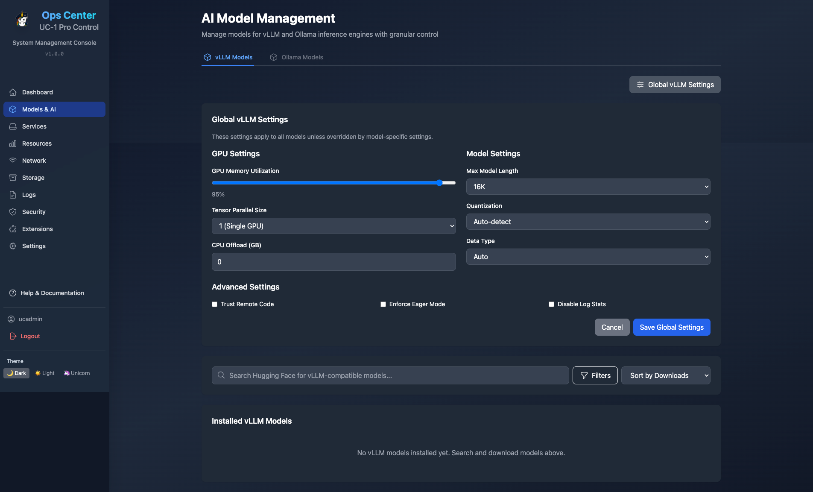
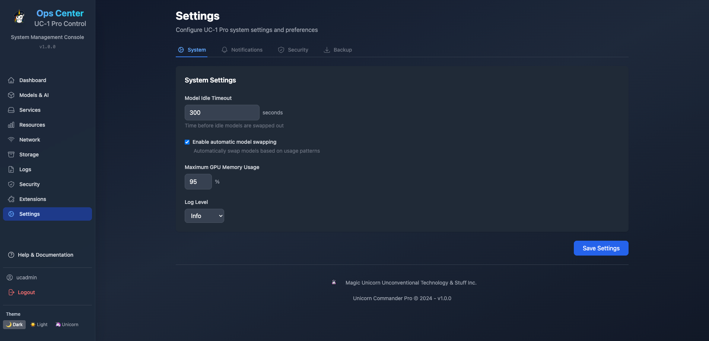

# UC-1 Pro - Enterprise AI Stack for RTX 5090 🚀

<div align="center">

[](https://github.com/Unicorn-Commander/UC-1-Pro/stargazers)
[](LICENSE)
[](https://www.docker.com/)
[](https://www.nvidia.com/)

**Transform your RTX 5090 into an AI powerhouse with UC-1 Pro**

[🌐 Website](https://unicorncommander.com) • [📖 Documentation](http://localhost:8081) • [🏢 Company](https://magicunicorn.tech) • [🐛 Issues](https://github.com/Unicorn-Commander/UC-1-Pro/issues)

</div>

---

## 🎯 What is UC-1 Pro?

UC-1 Pro is a **production-ready, enterprise-grade AI infrastructure stack** that unleashes the full potential of NVIDIA RTX 5090 GPUs. Built by [Magic Unicorn Unconventional Technology & Stuff Inc](https://magicunicorn.tech), it provides professional AI capabilities with enterprise authentication, a modern Operations Center, and single-command deployment.

### 🏆 **Development Status: 85% Complete**

#### ✅ **What's Working Now (75-80%)**
- **Core Infrastructure** - All 15+ services running, vLLM with Qwen2.5-32B, Ollama with 10+ models
- **Operations Center** - Professional UI, real-time monitoring, genuine Docker control
- **Model Management** - Detection, download, activation (minor timeout fixes needed)
- **Real Functionality** - Actual infrastructure control, not mock data!

#### 🚧 **What's Coming (15-20%)**
- **Enterprise Authentication** - Microsoft 365, Google Workspace, LDAP/AD (0% - next priority)
- **Production Hardening** - SSL/TLS, rate limiting, audit logging (5% started)
- **RBAC Implementation** - Role-based access control with fine-grained permissions

#### 📅 **Realistic Timeline**
- **Now (85%)** - Core platform functional, ready for development use
- **2 weeks (90%)** - Basic auth + bug fixes
- **6 weeks (95%)** - Enterprise SSO integrated
- **10 weeks (100%)** - Production-ready with full LDAP/AD support

### ✨ Key Features

#### ✅ **What's Actually Working Today**
- **🚀 Real Docker Orchestration** - Start/stop/restart services with actual container control
- **🤖 Model Management** - Detect, activate, and manage vLLM/Ollama models
- **📊 Live System Monitoring** - WebSocket-based real-time metrics
- **🎨 Professional Operations Center** - Enterprise-ready UI with Magic Unicorn theme
- **🔧 Service Integration** - 15+ AI services working together seamlessly

#### 🔐 **Enterprise Authentication (Next Priority - 0% Complete)**
- **Microsoft 365/Entra ID** - Azure AD integration with group-based roles (planned)
- **Google Workspace** - OAuth 2.0 with organizational mapping (planned)
- **LDAP/Active Directory** - On-premise AD support (planned)
- **Unified SSO** - Single sign-on across all services (planned)
- **RBAC** - Role-based access control (planned)

#### 🏢 **Enterprise Operations Center**
- **Instant Navigation** - Non-blocking UI with background data loading
- **Real Model Management** - Detect, activate, and delete vLLM/Ollama models
- **Live Service Control** - Genuine Docker container orchestration
- **Professional Dashboard** - Enterprise-ready design with Magic Unicorn theme
- **Real-time Monitoring** - WebSocket-based system health updates

#### ⚡ **AI Infrastructure**
- **🚀 vLLM Engine** - Running Qwen2.5-32B-Instruct-AWQ optimized for RTX 5090's 32GB VRAM
- **🦙 Ollama Integration** - 10+ models ready including Llama 3.2, Mistral, Gemma2, Qwen3
- **🎙️ WhisperX STT** - Advanced speech processing with speaker diarization
- **🗣️ Kokoro TTS** - Natural voice synthesis with Intel iGPU optimization
- **🔍 Center-Deep Search** - Custom SearXNG fork with AI-powered tool servers
- **📄 Apache Tika** - Document intelligence and OCR processing

#### 🛠️ **System Features**
- **📊 Built-in Monitoring** - Prometheus & Grafana for system insights
- **🔒 Enterprise Security** - Automated backups, SSL support, API authentication
- **🧩 Modular Architecture** - Enable only what you need
- **⚡ Smart Health Checks** - Accurate service status monitoring
- **📥 Model Management** - Download and manage AI models with progress tracking

## 📸 Operations Center Dashboard

UC-1 Pro includes a comprehensive web-based Operations Center for system administration and user access.

### 🏠 Main Dashboard Views

<div align="center">

#### User Dashboard & Homepage

<p><em>User-friendly interface with search capabilities and quick access to AI services</em></p>

#### Admin Dashboard  

<p><em>Complete system oversight with real-time monitoring and service management</em></p>

</div>

### 🛠️ Management Features

<div align="center">

<table>
<tr>
<td width="33%" align="center">

<br><strong>🤖 AI Model Management</strong>
<br>Search, download & manage LLM models
</td>
<td width="33%" align="center">

<br><strong>⚙️ Service Management</strong>  
<br>Real-time service monitoring & control
</td>
<td width="33%" align="center">

<br><strong>📊 System Monitoring</strong>
<br>GPU, CPU, memory & disk analytics
</td>
</tr>
<tr>
<td width="33%" align="center">

<br><strong>🔧 Settings & Config</strong>
<br>System configuration & preferences
</td>
<td width="33%" align="center">

<br><strong>🧩 Extensions</strong>
<br>One-click extension deployment
</td>
<td width="33%" align="center">

<br><strong>🔒 Security Center</strong>
<br>User accounts & API management
</td>
</tr>
</table>

</div>

## 🚀 Quick Start

### Prerequisites

- Ubuntu 24.04 LTS (Secure Boot compatible)
- NVIDIA RTX 5090 (32GB VRAM) - Detected and configured ✅
- 96GB RAM (minimum 64GB)
- 200GB+ storage (500GB+ recommended for models)
- Docker & NVIDIA Container Toolkit (auto-installed)

### Installation

```bash
# Clone the repository
git clone https://github.com/Unicorn-Commander/UC-1-Pro.git
cd UC-1-Pro

# Run the installer - it handles everything!
./install.sh

# (Optional) Pre-download models for faster startup
./scripts/download-models.sh

# Start your AI stack
./start.sh
```

That's it! The installer automatically configures Docker, NVIDIA drivers (with Secure Boot support), and all dependencies.

## 🖥️ Web Interfaces

Once running, access your AI services:

| Service | URL | Description |
|---------|-----|-------------|
| **Open-WebUI** | http://localhost:8080 | Main AI chat interface |
| **vLLM API** | http://localhost:8000 | OpenAI-compatible API |
| **Documentation** | http://localhost:8081 | Full system documentation |
| **Model Manager** | http://localhost:8084 | Manage AI models |
| **SearXNG** | http://localhost:8888 | Private search engine |

## 🏗️ Architecture

<details>
<summary>Click to expand architecture details</summary>

UC-1 Pro uses a microservices architecture with enterprise authentication gateway:

### Authentication Layer (New)
- **Auth Gateway** - Unified SSO for all services
- **Identity Providers** - Microsoft 365, Google, LDAP/AD
- **Session Management** - Redis-backed JWT tokens
- **RBAC Engine** - Role-based access control

### GPU Services (RTX 5090 - 32GB)
- **vLLM** - Running Qwen2.5-32B-Instruct-AWQ
- **ComfyUI** (Extension) - Flux image generation
- **Ollama** (Extension) - Additional model inference

### CPU/Intel iGPU Services  
- **WhisperX** - Speech-to-text processing
- **Kokoro TTS** - Text-to-speech on Intel AlderLake-S GT1
- **Embeddings** - BAAI/bge-base-en-v1.5
- **Reranker** - BAAI/bge-reranker-v2-m3

### Data Layer
- **PostgreSQL 16** - User accounts, metadata, RBAC
- **Redis 7.4** - Session store, caching, queuing
- **Qdrant 1.15** - Vector database for RAG

</details>

## 🛠️ Management Commands

```bash
# Quick actions
make start          # Start all services
make stop           # Stop all services
make status         # Check service status
make health         # Run health checks
make logs           # View all logs
make backup         # Backup databases

# Model management
./scripts/download-models.sh       # Pre-download all models
./scripts/switch-model.sh          # Switch between LLM models

# GPU management
./scripts/gpu-memory-manager.sh balanced  # Balance GPU between services
./scripts/gpu-memory-manager.sh full-llm  # Maximize for LLM

# Extensions
make monitoring     # Start Prometheus & Grafana
make comfyui       # Start ComfyUI for image generation
```

## 📦 Extensions

UC-1 Pro includes optional extensions for additional functionality:

- **🦙 Ollama** - Local LLM inference with 10+ models ready (port 11434) ✅ Integrated
- **🎨 ComfyUI** - Flux image generation with Kontext support
- **📊 Monitoring** - Prometheus + Grafana dashboards
- **🔧 Dev Tools** - Jupyter Lab, VS Code Server, database admin
- **🐳 Portainer** - Visual Docker management at port 9444 (ucadmin/MagicUnicorn!8-)
- **🔀 Traefik** - Reverse proxy with SSL/Let's Encrypt
- **⚡ Bolt.DIY** - Rapid AI app development
- **🔄 n8n** - Workflow automation
- **🔐 Keycloak** - Enterprise identity management (planned)

Enable extensions as needed:
```bash
cd extensions/[extension-name]
docker-compose up -d
```

## 🔧 Configuration

### Environment Variables

Key settings in `.env`:

```env
# Model Selection
DEFAULT_LLM_MODEL=Qwen/Qwen2.5-32B-Instruct-AWQ
GPU_MEMORY_UTIL=0.95

# Backup Schedule
BACKUP_SCHEDULE=0 2 * * *    # Daily at 2 AM
BACKUP_RETENTION_DAYS=7
```

### Switching Models

```bash
# Use the model manager UI
http://localhost:8084

# Or via script
./scripts/switch-model.sh
```

## 🛡️ Security & Maintenance

- **Automated Backups** - Daily backups with configurable retention
- **Health Monitoring** - Built-in health checks for all services
- **API Authentication** - Secure API keys for all endpoints
- **Update Management** - Simple Docker-based updates

## 📚 Documentation & Roadmap

Complete documentation is available at http://localhost:8081 after starting the stack.

### 📋 **Key Documentation**
- [DEVELOPMENT_CHECKLIST.md](DEVELOPMENT_CHECKLIST.md) - Complete development roadmap
- [AUTHENTICATION_ROADMAP.md](AUTHENTICATION_ROADMAP.md) - Enterprise SSO implementation plan
- [CLAUDE.md](CLAUDE.md) - Project context and architecture
- API Documentation - Swagger UI at `/docs`

### 📈 **Development Progress**

**✅ Completed (80%)**
- Docker orchestration and service integration
- Professional Operations Center UI
- Real-time monitoring with WebSockets
- Model detection and management
- Hardware detection (GPU, CPU, Memory)
- Service control (start/stop/restart)
- Performance optimizations
- Center-Deep search integration

**🚧 In Progress (5%)**
- Model API timeout fixes
- Documentation updates
- Testing and validation

**📋 TODO (15%)**
- Enterprise authentication (Microsoft/Google/LDAP)
- User registration and login
- Role-based access control
- Session management across services
- Production SSL/TLS setup
- Audit logging
- API rate limiting

Run the complete test suite:
```bash
./test_all_functionality.sh
```

View the detailed development checklist in [DEVELOPMENT_CHECKLIST.md](DEVELOPMENT_CHECKLIST.md)

## 🤝 Contributing

We welcome contributions! Please see our [Contributing Guide](CONTRIBUTING.md) for details.

1. Fork the repository
2. Create your feature branch (`git checkout -b feature/AmazingFeature`)
3. Commit your changes (`git commit -m 'Add some AmazingFeature'`)
4. Push to the branch (`git push origin feature/AmazingFeature`)
5. Open a Pull Request

## 📄 License

This project is licensed under the MIT License - see the [LICENSE](LICENSE) file for details.

## 🏢 About Magic Unicorn Tech

UC-1 Pro is developed by [Magic Unicorn Unconventional Technology & Stuff Inc](https://magicunicorn.tech), a company dedicated to making advanced AI technology accessible and practical for real-world applications. We believe in the power of open-source collaboration and building tools that empower developers and organizations to harness the full potential of modern AI hardware.

### 🦄 Why UC-1 Pro?

Born from the need for a production-ready AI stack that "just works," UC-1 Pro eliminates the complexity of integrating multiple AI services. Unlike typical admin panels with mock data, UC-1 Pro provides **genuine infrastructure management** with real Docker orchestration and actual model lifecycle control.

### 🚀 Honest Development Status

**We're 85% complete.** Here's the real deal:

✅ **What Works**: The core platform is functional. You can actually manage services, control models, monitor your system, and run AI workloads. This isn't a demo - it's real infrastructure control.

🚧 **What's Missing**: Enterprise authentication. We need to add Microsoft 365, Google Workspace, and LDAP integration to make this production-ready for organizations. That's the main 15% left.

📅 **Timeline**: 2 weeks for basic auth, 6 weeks for enterprise SSO, 10 weeks for full production readiness.

**Bottom line**: If you're a developer or small team, it's ready to use now. If you're an enterprise needing SSO and RBAC, give us 6-10 weeks.

---

<div align="center">

**Ready to unleash your RTX 5090?**

[⭐ Star this repo](https://github.com/Unicorn-Commander/UC-1-Pro) • [🚀 Get Started](#-quick-start) • [💬 Join our Community](https://github.com/Unicorn-Commander/UC-1-Pro/discussions)

Built with ❤️ and 🦄 magic by [Magic Unicorn Tech](https://magicunicorn.tech)

*Last Updated: August 12, 2025*

**Development Status: 85% Complete** | **Core Platform: ✅ Working** | **Enterprise Auth: 📋 Planned**

</div>