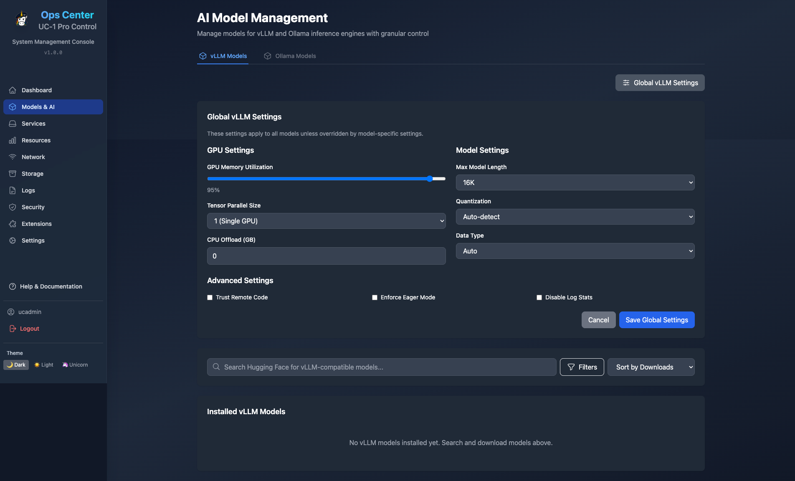
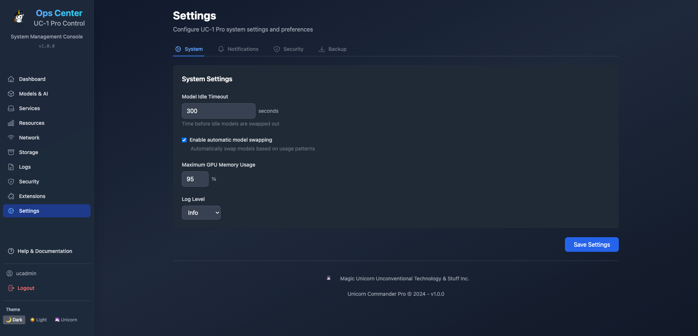

# UC-1 Pro Operations Center

[](https://unicorncommander.com)

The **UC-1 Pro Operations Center** is the comprehensive admin dashboard and control panel for the UC-1 Pro AI infrastructure stack. It provides administrators with real-time monitoring, service management, and configuration capabilities for all UC-1 Pro components.

## Overview

The Operations Center serves two primary audiences:
- **Administrators**: Complete system control, service management, and configuration
- **Users**: Search engine interface and shortcuts dashboard via Center-Deep integration

## Main Dashboard Views

### User Dashboard & Homepage
The user-facing interface provides quick access to AI services and search functionality.

<div align="center">
  
  <p><em>User Dashboard - Main interface for everyday users with search and quick actions</em></p>
</div>

### Admin Dashboard
The administrative interface offers complete system oversight and control.

<div align="center">
  
  <p><em>Admin Dashboard - Complete system monitoring and management interface</em></p>
</div>

## Feature Screenshots

<div align="center">

### AI Model Management
<a href="screenshots/AI-Model-Management.png">
  
</a>

### Service Management  
<a href="screenshots/Service Management.png">
  
</a>

### System Monitoring
<a href="screenshots/System Monitoring.png">
  
</a>

### Settings & Configuration
<a href="screenshots/Settings.png">
  
</a>

### Extensions Management
<a href="screenshots/Extensions.png">
  
</a>

</div>

## Quick Start

```bash
cd services/ops-center
docker compose up -d
```

Access at: http://localhost:8084

## Key Features

### 🎯 **Service Management**
- **Real-time Status**: Monitor all UC-1 Pro services with live health checks
- **Service Control**: Start, stop, restart services with single-click actions
- **Resource Monitoring**: Track CPU, memory, and GPU usage per service
- **Log Management**: View and export service logs for troubleshooting

### 🤖 **AI Model Management**
- **Model Discovery**: Search and discover models from Hugging Face Hub
- **Download & Install**: Automatic model downloading with progress tracking
- **Model Switching**: Hot-swap between different LLM models
- **Memory Estimation**: Calculate VRAM requirements before download
- **Quantization Support**: Support for AWQ, GPTQ, and other quantization formats

### 📊 **System Monitoring**
- **Hardware Monitoring**: Real-time GPU, CPU, memory, and disk metrics
- **Performance Analytics**: Historical data and trend analysis
- **Alert System**: Configurable alerts for resource thresholds
- **Network Status**: WiFi, Ethernet, and Bluetooth connectivity monitoring

### 🔒 **Security & User Management**
- **Multi-user Support**: Create and manage multiple user accounts
- **Role-based Access**: Admin and user role separation
- **API Key Management**: Generate and manage API keys for external access
- **Session Management**: Monitor and control active user sessions

### 📦 **Storage & Backup**
- **Volume Management**: Monitor Docker volumes and storage usage
- **Automated Backups**: Scheduled backups of critical data
- **Backup Restoration**: Easy restore functionality for disaster recovery
- **Storage Analytics**: Detailed breakdowns of disk usage by service

### 🧩 **Extensions System**
- **Extension Catalog**: Browse and install available extensions
- **One-click Installation**: Automated extension deployment
- **Extension Control**: Start, stop, and configure installed extensions
- **Custom Extensions**: Support for user-developed extensions

## Technical Architecture

### Frontend Stack
- **React 18** with modern hooks and context
- **Tailwind CSS** for responsive design
- **Vite** for fast development and building
- **WebSocket** connections for real-time updates

### Backend Stack
- **FastAPI** for high-performance API server
- **Docker SDK** for container management
- **PostgreSQL** for user and configuration data
- **Redis** for caching and session management

### Integration Points
- **Docker Engine** for service management
- **NVIDIA Docker Runtime** for GPU access
- **System APIs** for hardware monitoring
- **Hugging Face Hub** for model discovery

```
┌─────────────────────────────────────┐
│           Ops Center UI             │
│         (React + Tailwind)          │
└──────────────┬──────────────────────┘
               │ HTTP/WebSocket
┌──────────────┴──────────────────────┐
│        FastAPI Backend              │
│   - Model Management API            │
│   - System Control API              │
│   - Network Management API          │
│   - Docker Integration              │
└──────────────┬──────────────────────┘
               │
┌──────────────┴──────────────────────┐
│     System Resources                │
│   - Docker Socket                   │
│   - NetworkManager D-Bus            │
│   - System Commands                 │
└─────────────────────────────────────┘
```

## Getting Started

### Prerequisites
- UC-1 Pro main stack running
- Docker with NVIDIA runtime
- Modern web browser with JavaScript enabled

### Access URLs
- **User Interface**: http://localhost:8084
- **Admin Dashboard**: http://localhost:8084/admin
- **API Documentation**: http://localhost:8084/docs

### Default Credentials
- **Username**: `ucadmin`
- **Password**: `MagicUnicorn!8-)`

*⚠️ Change default credentials after first login for security*

## Configuration

### Environment Variables
- `ADMIN_USERNAME`: Default admin username
- `ADMIN_PASSWORD`: Default admin password
- `VLLM_URL`: vLLM service endpoint
- `VLLM_API_KEY`: vLLM API authentication key

### Volume Mounts
- `/var/run/docker.sock`: Docker socket access
- `./volumes:/volumes:ro`: UC-1 Pro volumes (read-only)
- `.env:/.env:ro`: Environment configuration

## API Endpoints

The Operations Center provides a comprehensive REST API:

```
GET  /api/v1/services          # List all services
POST /api/v1/services/{id}/action  # Control services
GET  /api/v1/system/status     # System metrics
GET  /api/v1/models           # Installed models
POST /api/v1/models/download   # Download models
GET  /api/v1/storage          # Storage information
POST /api/v1/backup/create     # Create backups
```

Full API documentation available at `/docs` endpoint.

## Development

### Local Development
```bash
cd services/ops-center
npm install
npm run dev
```

### Backend Development
```bash
cd services/ops-center/backend
pip install -r requirements.txt
python server.py
```

### Docker Build
```bash
docker build -t unicorn-ops-center .
```

## Security Considerations

- **API Authentication**: All admin endpoints require valid JWT tokens
- **Role Separation**: Clear distinction between admin and user capabilities
- **Session Management**: Configurable session timeouts and security
- **Docker Socket**: Secure access to Docker daemon through mounted socket

## Troubleshooting

### Common Issues

1. **Services showing as stopped**: Check Docker socket permissions
2. **GPU not detected**: Verify NVIDIA Docker runtime installation
3. **Model download fails**: Check internet connectivity and disk space
4. **Login issues**: Verify default credentials or reset via Docker logs

### Debug Mode
Enable debug logging by setting `LOG_LEVEL=debug` in environment variables.

### Support Resources
- **Documentation**: http://localhost:8081
- **Health Check**: `./scripts/health-check-detailed.sh`
- **Issue Tracker**: [GitHub Issues](https://github.com/magic-unicorn/uc-1-pro/issues)

## License

MIT License - see [LICENSE](../../LICENSE) file for details.

## Contributing

Contributions welcome! Please see our contributing guidelines and submit pull requests for improvements.

---

<div align="center">
  <p><strong>UC-1 Pro Operations Center</strong></p>
  <p>Built with ❤️ by <a href="https://unicorncommander.com">Magic Unicorn Unconventional Technology & Stuff Inc</a></p>
</div>